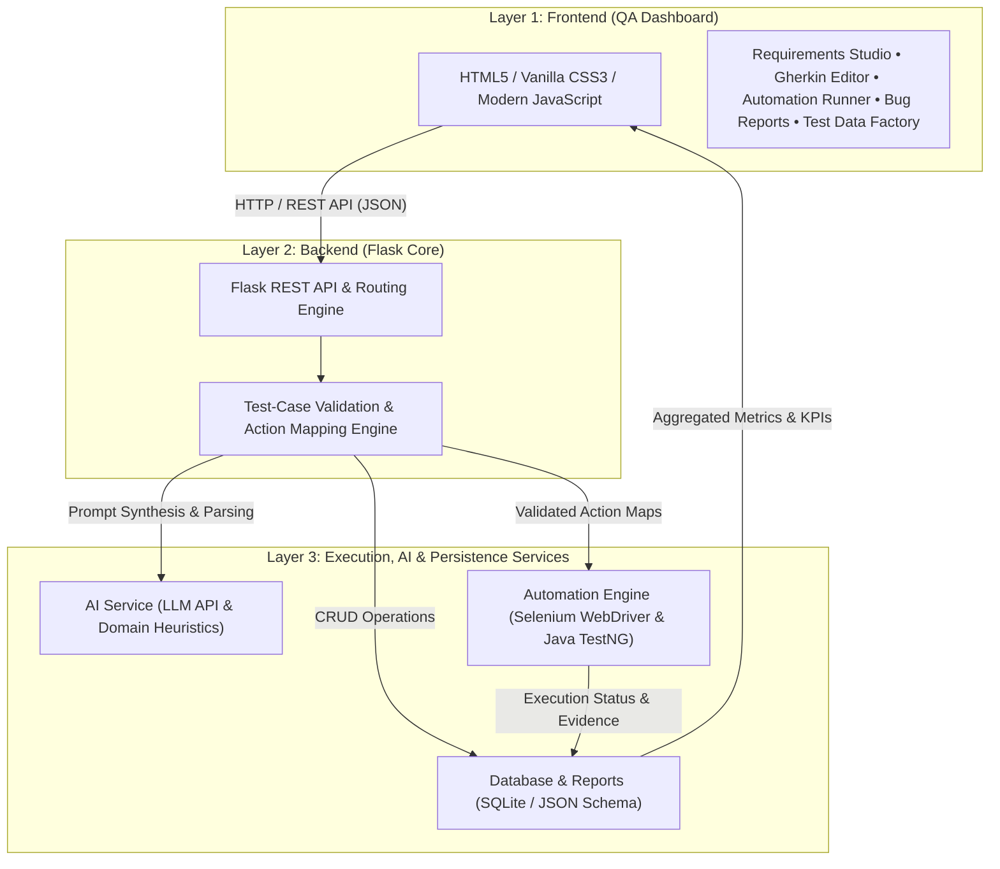

# System Architecture & Technical Design

## 1. High-Level Architecture Overview

The **AI-Powered QA Testing Assistant** platform is structured into **3 core layers**:

---

## 2. Core Layers Breakdown

### Layer 1: Frontend — QA Dashboard (HTML / CSS / JavaScript)
- **Glassmorphic Cyberpunk Theme**: Dark-slate base (`#0a0f1d`), neon cyan (`#00e5ff`) and electric blue (`#3b82f6`) glowing highlights with dynamic canvas sparklines.
- **Human-in-the-Loop Review**: Gherkin syntax-highlighted editor allowing testers to review, edit, and approve test cases before automation.
- **Real-Time Execution Console**: Live streaming WebDriver terminal logs and progress bar.
- **Interactive AI Copilot**: Slide-out assistant drawer for real-time Gherkin suggestions and locator queries.

### Layer 2: Backend — Flask Application Logic
- **RESTful Endpoints**: Handles requirements intake, test case lifecycle, execution triggers, and report synthesis.
- **Action Mapping & Validation**: Crucial safety boundary ensuring natural language generated by AI is validated and mapped against known browser actions (`navigate`, `click`, `input`, `assert_text`, `assert_visible`, `assert_disabled`) before execution.

### Layer 3: Services & Persistence
- **AI Service (`ai_service.py`)**: Hybrid engine supporting Google Gemini API, OpenAI API, and offline QA domain heuristics.
- **Automation Runner (`selenium_runner.py` / `Java TestNG`)**: Headless and headed browser execution with automatic failure screenshot capture and error diagnostics.
- **Database & Reports (`qa_assistant.db`)**: SQLite storage tracking Requirements, Test Cases, Suites, Runs, and AI Root Cause Analysis Bug Reports.

---

## 3. Important Technical Decision

> [!IMPORTANT]
> **AI-generated natural language test cases are NEVER executed directly as arbitrary shell or eval code.**
> Every AI scenario is first validated into structured JSON steps, mapped to safe Selenium WebDriver actions, and requires human tester approval (`status = 'APPROVED'`). This ensures 100% predictable, repeatable, and safe test execution.
